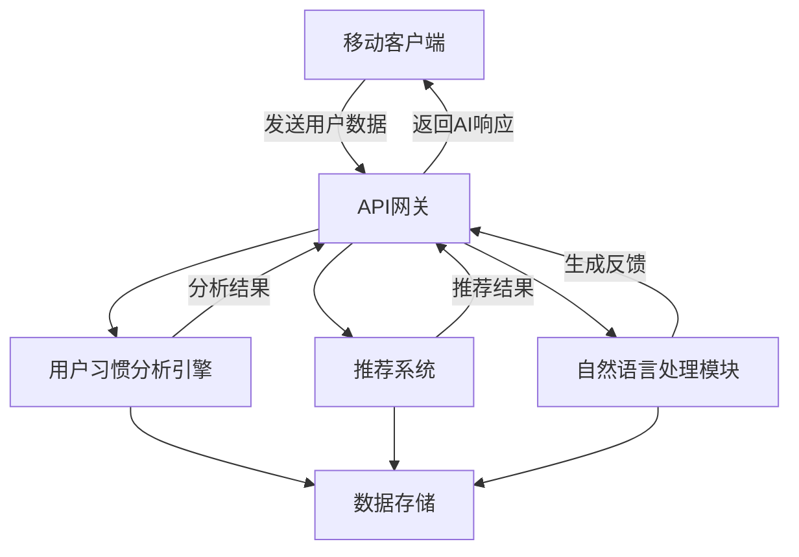

# Design Document: AI-Powered Habit Management

## Overview

HabitGem的AI功能设计旨在通过人工智能技术增强用户的习惯养成体验。本设计文档详细说明了如何将AI功能无缝集成到现有的应用设计中，包括AI推荐系统、进度反馈机制、数据分析和自然语言交互等核心功能。

## Architecture

### 系统架构

HabitGem的AI功能采用客户端-服务器架构，主要包含以下组件：

1. **移动客户端**
   - 用户界面层：展示AI推荐、反馈和分析结果
   - 本地数据层：缓存用户习惯数据和基本AI模型
   - 网络层：与AI服务器通信

2. **AI服务器**
   - API网关：处理客户端请求
   - 用户习惯分析引擎：分析用户习惯模式
   - 推荐系统：生成个性化习惯建议
   - 自然语言处理模块：处理用户查询和生成反馈
   - 数据存储：安全存储用户习惯数据和AI模型

3. **数据流向**
   - 用户数据从客户端发送到服务器进行分析
   - AI生成的建议和反馈从服务器返回到客户端
   - 部分轻量级AI功能在客户端本地执行



## Components and Interfaces

### 1. AI推荐系统

#### 功能描述
- 基于用户输入的偏好、目标和历史数据生成个性化习惯推荐
- 提供科学依据支持的习惯建议
- 随着用户数据积累优化推荐算法

#### 接口设计
```kotlin
interface HabitRecommendationService {
    // 获取初始习惯推荐
    suspend fun getInitialRecommendations(userPreferences: UserPreferences): List<HabitRecommendation>
    
    // 基于现有习惯获取推荐
    suspend fun getPersonalizedRecommendations(userId: String): List<HabitRecommendation>
    
    // 获取习惯科学依据
    suspend fun getHabitEvidence(habitId: String): HabitEvidence
}

data class HabitRecommendation(
    val id: String,
    val name: String,
    val description: String,
    val category: HabitCategory,
    val difficulty: Int, // 1-5
    val recommendationReason: String,
    val scientificBasis: String,
    val suggestedFrequency: Frequency,
    val estimatedTimePerDay: Int // 分钟
)
```

### 2. AI进度反馈系统

#### 功能描述
- 生成个性化的习惯完成反馈
- 提供基于用户历史数据的进度分析
- 在关键里程碑提供特别鼓励

#### 接口设计
```kotlin
interface ProgressFeedbackService {
    // 获取打卡完成反馈
    suspend fun getCompletionFeedback(userId: String, habitId: String): FeedbackMessage
    
    // 获取习惯详情页进度分析
    suspend fun getProgressAnalysis(userId: String, habitId: String): ProgressAnalysis
    
    // 获取周/月总结报告
    suspend fun getPeriodicReport(userId: String, period: ReportPeriod): PeriodicReport
}

data class FeedbackMessage(
    val message: String,
    val type: FeedbackType, // COMPLETION, STREAK, MILESTONE
    val emoji: String?,
    val animationType: AnimationType?
)

data class ProgressAnalysis(
    val completionRate: Float,
    val streak: Int,
    val insight: String,
    val suggestion: String,
    val visualData: List<DataPoint>
)
```

### 3. AI习惯分析系统

#### 功能描述
- 分析用户习惯执行模式和完成率
- 识别习惯执行中的障碍和成功因素
- 提供数据驱动的习惯优化建议

#### 接口设计
```kotlin
interface HabitAnalysisService {
    // 获取习惯执行洞察
    suspend fun getHabitInsights(userId: String, habitId: String): HabitInsight
    
    // 获取习惯优化建议
    suspend fun getOptimizationSuggestions(userId: String, habitId: String): List<OptimizationSuggestion>
    
    // 获取习惯关联分析
    suspend fun getHabitCorrelations(userId: String): List<HabitCorrelation>
}

data class HabitInsight(
    val habitId: String,
    val bestPerformingDays: List<DayOfWeek>,
    val completionTrend: Trend,
    val consistencyScore: Float,
    val insightMessage: String
)

data class OptimizationSuggestion(
    val type: SuggestionType, // TIME_CHANGE, FREQUENCY_ADJUST, DIFFICULTY_ADJUST
    val message: String,
    val expectedImpact: String,
    val confidence: Float // 0.0-1.0
)
```

### 4. AI助手对话系统

#### 功能描述
- 提供自然语言交互界面
- 回答习惯相关问题和提供建议
- 基于用户数据提供个性化支持

#### 接口设计
```kotlin
interface AIAssistantService {
    // 发送用户消息并获取回复
    suspend fun sendMessage(userId: String, message: String): AssistantResponse
    
    // 获取上下文相关建议
    suspend fun getContextualSuggestions(userId: String, context: AssistantContext): List<AssistantSuggestion>
}

data class AssistantResponse(
    val message: String,
    val type: ResponseType, // TEXT, SUGGESTION, ANALYSIS
    val relatedHabits: List<String>?,
    val actionSuggestions: List<AssistantAction>?
)

enum class AssistantContext {
    HABIT_CREATION,
    HABIT_COMPLETION,
    MISSED_HABIT,
    PROGRESS_REVIEW,
    GENERAL
}
```

## Data Models

### 核心数据模型

#### User Model
```kotlin
data class User(
    val id: String,
    val name: String,
    val preferences: UserPreferences,
    val createdAt: Long,
    val lastActive: Long
)

data class UserPreferences(
    val habitCategories: List<HabitCategory>,
    val goalTypes: List<GoalType>,
    val reminderPreferences: ReminderPreferences,
    val difficultyPreference: Int, // 1-5
    val timeAvailability: Map<DayOfWeek, List<TimeSlot>>
)
```

#### Habit Model
```kotlin
data class Habit(
    val id: String,
    val userId: String,
    val name: String,
    val description: String,
    val category: HabitCategory,
    val frequency: Frequency,
    val reminderSettings: ReminderSettings?,
    val startDate: Long,
    val targetDays: Int?,
    val color: String,
    val icon: String,
    val isAIRecommended: Boolean,
    val difficulty: Int, // 1-5
    val createdAt: Long,
    val lastModified: Long
)
```

#### HabitRecord Model
```kotlin
data class HabitRecord(
    val id: String,
    val habitId: String,
    val userId: String,
    val date: Long,
    val isCompleted: Boolean,
    val completionTime: Long?,
    val note: String?,
    val mood: Mood?,
    val difficulty: Int? // 用户反馈的难度 1-5
)
```

#### AI Feedback Model
```kotlin
data class AIFeedback(
    val id: String,
    val userId: String,
    val habitId: String?,
    val feedbackType: FeedbackType,
    val message: String,
    val generatedAt: Long,
    val isRead: Boolean,
    val relatedData: Map<String, Any>?
)
```

## Error Handling

### 错误处理策略

1. **网络错误**
   - 实现离线模式，在无网络连接时使用缓存的AI模型提供基本功能
   - 当网络恢复时自动同步数据并更新AI建议

2. **AI服务错误**
   - 设置超时机制，避免长时间等待AI响应
   - 提供优雅的降级策略，在AI服务不可用时回退到基本功能

3. **数据隐私错误**
   - 实现严格的数据访问控制，确保AI只处理授权的用户数据
   - 提供透明的数据使用说明和撤回同意的选项

4. **内容适当性**
   - 实现内容过滤机制，确保AI生成的内容适当且积极
   - 提供用户反馈机制，允许报告不适当的AI响应

5. **错误日志和监控**
   - 实现详细的错误日志记录，帮助识别和解决AI系统问题
   - 设置监控系统，跟踪AI性能和用户满意度

## Testing Strategy

### 测试方法

1. **单元测试**
   - 测试各AI组件的核心功能
   - 验证数据处理和转换逻辑

2. **集成测试**
   - 测试AI服务与应用其他组件的交互
   - 验证数据流和API调用

3. **用户体验测试**
   - 进行A/B测试比较不同AI反馈策略的效果
   - 收集用户对AI建议和反馈的评价

4. **性能测试**
   - 测试AI响应时间和资源使用
   - 验证系统在高负载下的表现

5. **安全和隐私测试**
   - 进行数据安全审计
   - 验证隐私保护措施的有效性

### 测试指标

- AI推荐接受率：用户接受AI推荐的比例
- 反馈有效性：用户对AI反馈的积极响应率
- 习惯坚持率：使用AI功能的用户vs不使用AI功能的用户
- 用户满意度：通过应用内调查收集
- 系统性能：AI响应时间和资源使用

## UI Integration

### AI功能UI集成

1. **习惯推荐UI**
   - 在"新建习惯"页面添加"AI推荐"选项卡
   - 设计推荐卡片展示习惯名称、描述、科学依据和预期效果
   - 提供"接受推荐"和"查看更多"按钮

```
┌─────────────────────────────┐
│ ← 新建习惯                  │
├─────────────────────────────┤
│ [手动创建] [AI推荐]          │
├─────────────────────────────┤
│  推荐习惯: 晨间冥想          │
│  描述: 每天早晨进行10分钟冥想 │
│  科学依据: 研究表明...        │
│  难度: ★★☆☆☆               │
│  [接受] [查看更多]           │
└─────────────────────────────┘
```

2. **进度反馈UI**
   - 在习惯打卡后显示动画反馈和鼓励消息
   - 在习惯详情页添加"AI洞察"部分
   - 设计周/月报告卡片

```
┌─────────────────────────────┐
│ 习惯详情: 晨间冥想           │
├─────────────────────────────┤
│ [日历视图]                   │
├─────────────────────────────┤
│ AI洞察                      │
│ 你在周二和周四的完成率最高    │
│ 连续坚持可以提升15%的专注力   │
│ [查看完整分析]               │
└─────────────────────────────┘
```

3. **AI助手UI**
   - 添加浮动AI助手按钮
   - 设计对话界面，支持文本输入和快捷问题
   - 提供上下文相关的建议

```
┌─────────────────────────────┐
│ AI助手                      │
├─────────────────────────────┤
│ 你好！我能帮你什么?          │
│                             │
│ [我的习惯进度如何?]          │
│ [推荐新习惯]                 │
│ [如何提高坚持度?]            │
├─────────────────────────────┤
│ 输入问题...        [发送]    │
└─────────────────────────────┘
```

## Privacy and Security

### 隐私保护措施

1. **数据最小化**
   - 只收集必要的用户数据用于AI功能
   - 提供选择性数据共享选项

2. **数据加密**
   - 传输中加密：使用TLS/SSL保护数据传输
   - 存储中加密：加密存储敏感用户数据

3. **用户控制**
   - 提供清晰的隐私设置界面
   - 允许用户查看、导出和删除其数据

4. **透明度**
   - 提供清晰的AI功能说明和数据使用政策
   - 在首次使用AI功能时获取明确同意

5. **安全审计**
   - 定期进行安全评估和漏洞扫描
   - 实施访问控制和监控机制

## Implementation Considerations

### 技术选择

1. **AI模型**
   - 推荐系统：协同过滤和基于内容的混合推荐算法
   - 自然语言处理：使用预训练语言模型如BERT或GPT
   - 数据分析：时间序列分析和模式识别算法

2. **后端技术**
   - 服务器：Kotlin + Spring Boot
   - 数据库：MongoDB (用户数据) + Redis (缓存)
   - API：RESTful API + GraphQL

3. **移动端技术**
   - Kotlin + Jetpack Compose
   - 本地ML模型：TensorFlow Lite
   - 数据存储：Room数据库

### 性能优化

1. **响应时间优化**
   - 在客户端缓存常用AI响应
   - 使用轻量级模型进行初步分析
   - 实现异步处理机制

2. **资源使用优化**
   - 批量处理AI请求
   - 实现智能数据同步策略
   - 优化模型大小和复杂度

3. **电池使用优化**
   - 限制后台AI处理
   - 根据设备状态调整AI功能使用

## Phased Implementation

### 实施阶段

1. **第一阶段：基础AI功能**
   - 实现基本习惯推荐系统
   - 添加简单的完成反馈消息
   - 建立数据收集和分析基础架构

2. **第二阶段：增强分析和个性化**
   - 实现详细的习惯分析功能
   - 增强个性化推荐算法
   - 添加进度报告和洞察功能

3. **第三阶段：AI助手和高级功能**
   - 实现自然语言AI助手
   - 添加高级习惯关联分析
   - 实现社交功能和群组建议